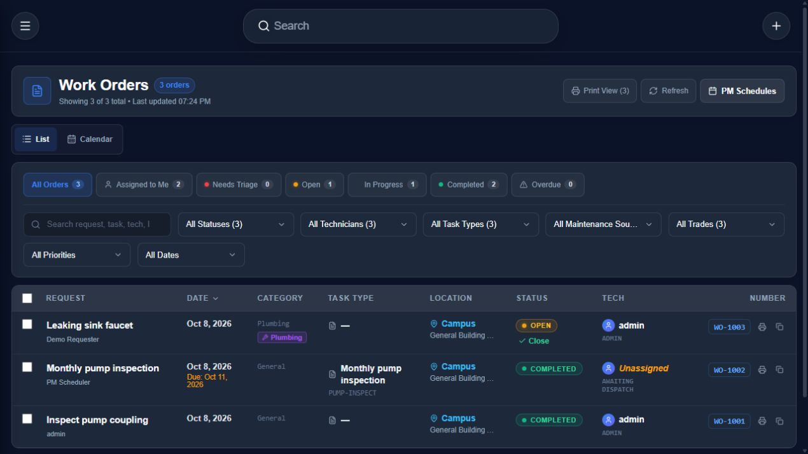
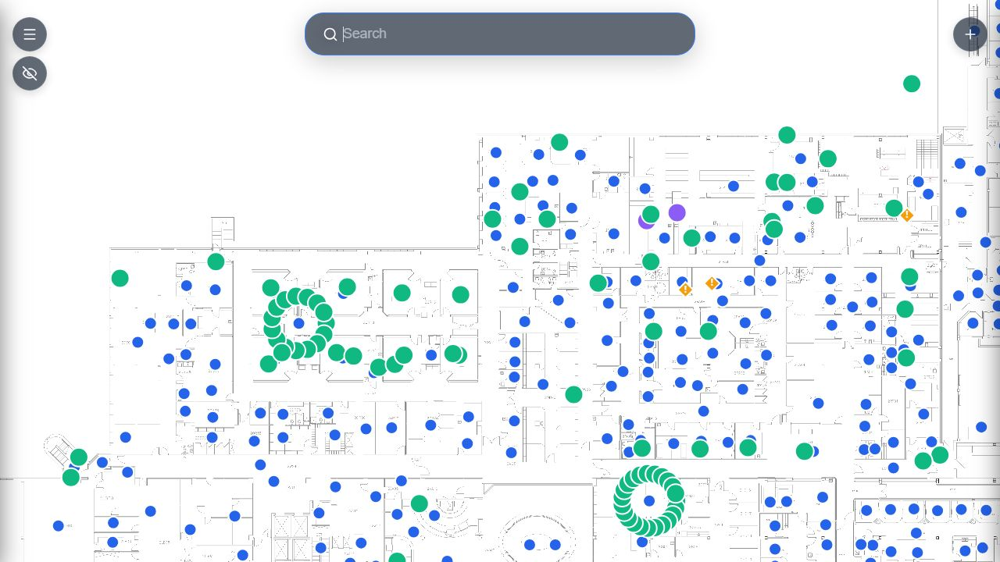
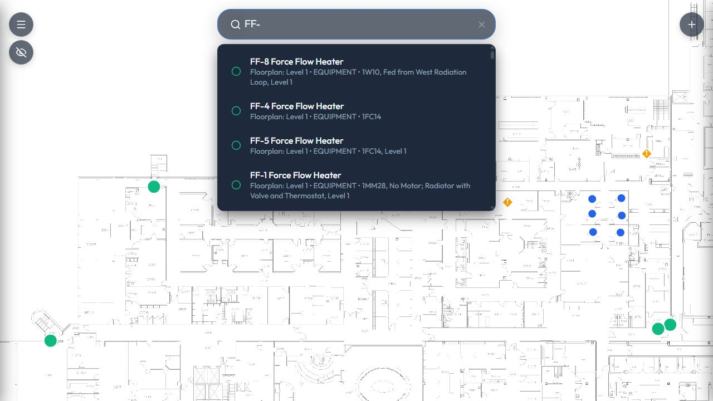

# EquipMap Community CMMS

EquipMap is a self-hosted facilities application that links rooms, equipment,
maintenance tickets, and audit history to interactive floorplans.

The `cmms` branch adds the complete native work-order system: public maintenance
requests, triage, assignment, labor and comments, completion, calendar and print
views, task sheets, trades, and recurring preventive maintenance. All records
are managed by EquipMap itself. TMA/WebTMA is not required or included.

Use `main` for the smaller floorplan/asset release, or clone this edition with:

```sh
git clone --branch cmms https://github.com/ryleymcc/equipmap-community.git
cd equipmap-community
```

See the [CMMS setup and workflow guide](docs/CMMS.md).

The frontend uses React, Vite, and a PWA service worker. The API uses FastAPI,
SQLAlchemy, and PostgreSQL. PDF processing and OCR use PyMuPDF and Tesseract.

### Native work orders

The CMMS edition manages requests, assignments, labor, completion, and recurring
maintenance directly. This local demonstration uses synthetic records.



### Interactive floorplans

Level 2 with room and equipment pins placed directly on the drawing.



### Equipment search

Searching `FF-` from Level 2 shows matching equipment across floorplans and recorded descriptions.



## Start locally

Install Docker Engine/Desktop with Docker Compose v2, then:

```sh
cp .env.example .env
```

Set independent random values for `DB_PASSWORD`, `SECRET_KEY`, and
`INITIAL_ADMIN_PASSWORD` in `.env`. Generate each with:

```sh
python -c "import secrets; print(secrets.token_hex(32))"
docker compose up -d --build
docker compose logs backend
```

Open http://localhost and sign in as `admin` with your configured password.
Create your site and upload a floorplan. No facility data, credentials, or
production database are included. On PowerShell use `Copy-Item .env.example .env`.

Read the [hosting guide](docs/HOSTING.md) for HTTPS, backups, upgrades, and
troubleshooting. See [contributing](CONTRIBUTING.md), [security](SECURITY.md),
and [release notes](docs/RELEASE.md).

## Scope and limitations

- Offline access is intended for previously cached information; verify critical
  records online. Browser caches may retain facility data on shared devices.
- ChatGPT/MCP is optional and disabled by default.
- Facility reads and upload URLs allow unauthenticated viewing. Deploy behind restricted network
  access when plans or attachments are sensitive; see the security policy.
- The health endpoint reports API liveness, not database readiness.
- This project does not claim SOC 2 certification.

## License

AGPL-3.0-only. See [LICENSE](LICENSE). Dependencies retain their own licenses;
see [third-party notices](THIRD_PARTY_NOTICES.md). When operating a modified
version over a network, provide its corresponding source as required by AGPL.
